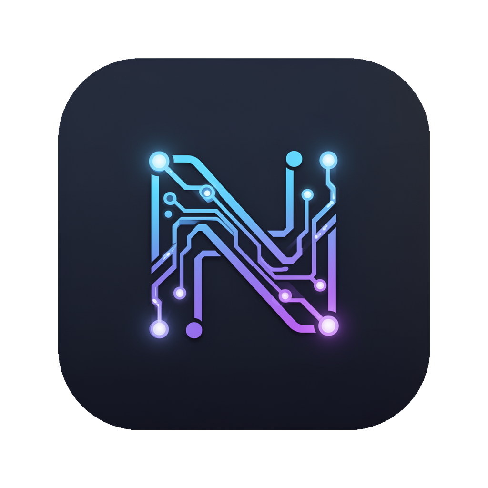

<div align="center">



# Nex Agent

**An open-source desktop AI agent for image, video, audio creation and beyond.**

[English](#english) · [中文](#中文)

[](LICENSE)
[](https://www.electronjs.org)
[](https://react.dev)
[](https://mastra.ai)
[](https://pnpm.io)

</div>

---

## 中文

### Nex Agent 是什么

Nex Agent 是一款基于 **Electron + React 19 + [Mastra](https://mastra.ai)** 的开源桌面 AI 智能体应用。它把"对话 + 工具调用 + 文件系统 + MCP + 系统技能"打包成一个一站式工作台，让你在本地用一句话就能调动 AI 完成图像生成、视频生成、视频剪辑、电商详情页、播客合成、视频解析等创作任务。

### 核心特性

- **对话式 Agent** — 流式输出、工具调用可视化、消息历史持久化、上传图片
- **多分身模板（Agent Templates）** — 内置 10 套开箱即用的预设分身（通用助手、人物角色设计、电商图、视频剪辑、宠物科普口播视频…），也可自定义新建、导入/导出
- **19 个系统技能（System Skills）** — 内置一批高质量的 SKILL.md 工作流，覆盖主流图像/视频/语音模型与 CapCut 草稿生成
- **MCP 服务器集成** — 通过 [MCP](https://modelcontextprotocol.io) 协议接入任意第三方工具
- **沙箱化文件系统工具** — 默认在用户家目录工作，支持 macOS Seatbelt 与 Linux bwrap 隔离
- **多语言界面** — 简体中文 / English / 日本語
- **多端登录** — 邮箱密码 / 邮箱验证码 / Google OAuth / 微信扫码

### 内置分身

| 分身 | 说明 |
|------|------|
| 通用助手 | 万能对话/写作/编程 |
| 人物角色设计 | 角色立绘 + 多角度参考图 |
| 电商产品图设计 | 白底主图、详情页、场景图 |
| 视频无水印下载 | 抖音/快手/小红书/B站/YouTube 等全平台 |
| Flux 图像助手 | 文生图、图像编辑、提示词优化 |
| 宠物知识科普口播视频 | 1 分钟竖版口播视频（4×15s）+ ffmpeg 拼接 |
| 高端产品宣传图 | 多角度提取 + 营销构图（基于 Nano Banana 2） |
| 图片多语言翻译 | 保留布局，文字本地化为中/英/日/泰 |
| 播客对话合成 | 多人对话脚本 + Gemini TTS 多说话人合成 |
| CapCut 剪辑分身 | 用 cutcli 命令行自动生成 CapCut 国际版草稿 |

### 系统技能（System Skills）

每个技能都是一份独立的 `SKILL.md`，由 Agent 按需调用。涵盖：

`xskill-ai` · `seedream-image` · `seedance-video` · `nano-banana-2` · `flux2-flash` · `upload-image` · `parse-video` · `ffmpeg` · `cut-master` · `cut-draft` · `cut-text-design` · `cut-audio` · `character-design` · `ecom-product-design` · `pet-knowledge-video` · `product-promo-design` · `image-translate` · `podcast-dialogue` · `video-downloader`

### 技术栈

| 层 | 技术 |
|----|------|
| Shell | Electron 36（主进程 + Worker 子进程跑 Agent，避免阻塞 UI） |
| UI | React 19 + Vite 6 + Tailwind CSS 4 + Zustand |
| Agent 引擎 | [@mastra/core](https://github.com/mastra-ai/mastra) 1.25 + `@ai-sdk/openai-compatible` |
| MCP | `@mastra/mcp` 1.5 |
| 持久化 | 主进程文件 store（JSON）+ `@mastra/libsql`（消息记忆） |
| 国际化 | i18next + react-i18next（zh-CN / en / ja） |
| 包管理 | pnpm workspace |

### Monorepo 结构

```
mastra-video/
├── packages/
│   ├── app/          # Electron 桌面应用（main + preload + renderer）
│   │   ├── src/main/         # Electron 主进程、IPC、AppStore、auth
│   │   ├── src/preload/      # contextBridge API 暴露
│   │   ├── src/renderer/     # React UI（pages / components / stores / i18n）
│   │   ├── resources/system-skills/   # 19 个内置 SKILL.md
│   │   └── electron-builder.json
│   ├── core/         # Agent 引擎（不依赖 Electron，纯 Node）
│   │   ├── src/engine/       # session-agent, agent-manager
│   │   ├── src/tools/        # workspace-tools, apiz-tools
│   │   └── src/services/     # apiz-client（NEX AI SDK 扩展）
│   └── skills/       # 用户技能样例
├── docs/
└── pnpm-workspace.yaml
```

### 快速开始

#### 1. 环境准备

- **Node.js** ≥ 20
- **pnpm** ≥ 9（`npm i -g pnpm`）
- macOS / Windows / Linux 桌面环境

#### 2. 克隆 & 安装

```bash
git clone https://github.com/xuliang2024/nex-agent.git
cd nex-agent
pnpm install
```

#### 3. 配置 API Key

```bash
cp .env.example .env
# 编辑 .env 填入你的 SUTUI_API_KEY 和 OPENROUTER_API_KEY
```

> **不想配 .env？** 启动后在登录页注册/登录 NEX AI 账号，应用会自动获取并保存 API Key。

#### 4. 启动开发模式

```bash
pnpm dev
```

#### 5. 打包桌面应用

```bash
pnpm build              # 构建 main / preload / renderer / worker bundle
cd packages/app
pnpm dist               # 用 electron-builder 打 .dmg / .exe / .AppImage
```

构建产物输出在 `packages/app/release/`。

> **macOS 签名 & 公证（可选）**：填写 `.env` 中的 `CSC_NAME`、`APPLE_ID`、`APPLE_APP_SPECIFIC_PASSWORD`、`APPLE_TEAM_ID` 后会自动签名公证；缺失任意一项则跳过。

### 测试

```bash
pnpm test               # 跑 core + app 的所有 vitest 用例
```

### 后端 API

App 默认连到 NEX AI 的公开后端 `https://api.apiz.ai`（备域名 `https://api.xskill.ai`）。这是一个完全开源前端 + SaaS 后端的混合架构 —— 你**不需要自己部署后端**就能用，但如果想换成自己的后端，改 `packages/core/src/services/apiz-client.ts` 中的 `DEFAULT_BASE_URL` 即可。

接口文档见 [docs/login-api-guide.md](docs/login-api-guide.md) 与 [docs/OPENROUTER_LLM_API.md](docs/OPENROUTER_LLM_API.md)。

### 贡献

欢迎 Issue / PR！特别欢迎：

- 新的内置分身模板和系统技能
- 第三方模型适配（Suno、ElevenLabs、Sora、Veo…）
- 新语言的 i18n 翻译
- macOS 之外的打包验证（Windows / Linux）

### 许可证

[MIT License](LICENSE)

---

## English

### What is Nex Agent

Nex Agent is an open-source desktop AI agent built on **Electron + React 19 + [Mastra](https://mastra.ai)**. It packs "chat + tool calls + file system + MCP + system skills" into a single workbench, letting you orchestrate AI for image generation, video generation, video editing, e-commerce assets, podcast synthesis, and video parsing — all locally, all in plain language.

### Features

- **Streaming chat agent** with tool-call visualization, persistent message history, and image upload
- **10 built-in agent templates** (general assistant, character design, e-commerce, video editor, pet knowledge shorts...) — fully customizable, importable, exportable
- **19 system skills** — curated SKILL.md workflows covering mainstream image/video/voice models and CapCut draft generation via `cutcli`
- **MCP integration** — plug in any third-party tools via [Model Context Protocol](https://modelcontextprotocol.io)
- **Sandboxed file system tools** — defaults to user home; supports macOS Seatbelt & Linux bwrap isolation
- **i18n** — Simplified Chinese / English / Japanese
- **Multiple sign-in** — email + password, email code, Google OAuth, WeChat QR

### Tech Stack

| Layer | Tech |
|-------|------|
| Shell | Electron 36 (main + worker subprocess for agent) |
| UI | React 19 + Vite 6 + Tailwind CSS 4 + Zustand |
| Agent | [`@mastra/core`](https://github.com/mastra-ai/mastra) 1.25 + `@ai-sdk/openai-compatible` |
| MCP | `@mastra/mcp` 1.5 |
| Storage | JSON store (main process) + `@mastra/libsql` (memory) |
| i18n | i18next + react-i18next (zh-CN / en / ja) |
| Package manager | pnpm workspace |

### Quick Start

```bash
git clone https://github.com/xuliang2024/nex-agent.git
cd nex-agent
pnpm install

cp .env.example .env       # fill in SUTUI_API_KEY & OPENROUTER_API_KEY
                           # (or sign in inside the app to auto-fetch)

pnpm dev                   # development
pnpm --filter @agent-desktop/app dist   # package .dmg / .exe / .AppImage
```

Requires Node ≥ 20 and pnpm ≥ 9.

### Build Artifacts

- macOS arm64 → `packages/app/release/Nex Agent-<ver>-arm64.dmg`
- Windows / Linux → configurable in `packages/app/electron-builder.json`

### Backend

The app talks to the public NEX AI backend at `https://api.apiz.ai` by default. You **don't need to host any backend** to use it. To switch to your own, edit `DEFAULT_BASE_URL` in `packages/core/src/services/apiz-client.ts`.

### Contributing

PRs welcome — especially for new agent templates, system skills, third-party model integrations, additional languages, and Windows / Linux packaging validation.

### License

[MIT](LICENSE)
