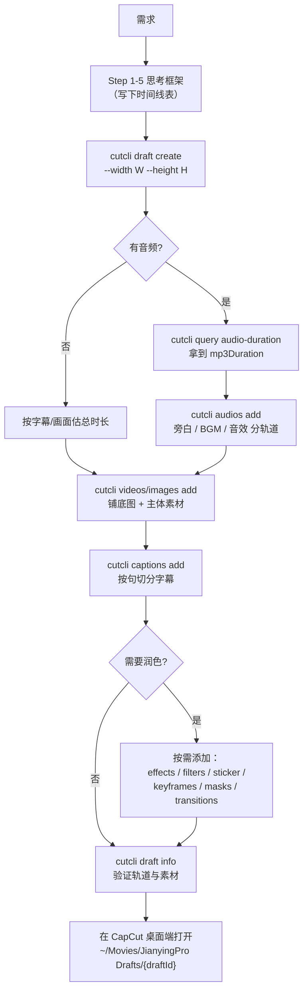

> **⚠️ Nex Agent 环境说明（重要）**
>
> - 本 cutcli 工具生成的是 **CapCut 国际版** 草稿（特效/动画/花字/转场资产名都是 CapCut 国际版的命名）。
> - macOS 默认草稿目录为 `~/Movies/CapCut/User Data/Projects/com.lveditor.draft/<draftId>/`，**不是** 国内版剪映的 `~/Movies/JianyingPro Drafts/`。
> - 应在 **CapCut 桌面端** 打开。**国内版剪映（JianyingPro）大概率无法识别本草稿的特效/动画/花字**，可能出现"特效缺失"、字幕样式异常或直接打不开。
> - 如用户安装的是国内版剪映，**先告知此约束并征求确认**；本工具不提供国内版兼容方案。
> - 下文如出现 `~/Movies/JianyingPro Drafts/...` 路径，请以本节 CapCut 路径为准。


# cut_cli 剪辑思维总指挥

## 何时使用此 skill

读完这个 skill，你应该能：

- 拿到任意"做一个 XX 视频"的需求时，按 5 步框架完成思考
- 知道每条轨道在剪映里扮演什么角色、应该按什么顺序叠加
- 写出符合时间线节奏的字幕、画面切换和音乐
- 准确路由到具体的子 skill 完成细节操作

> **如果只是查 API 参数或某类素材的字段，直接读对应子 skill；这里只讲"怎么思考"。**

## 时间单位（必须先记住）

cut_cli 所有时间参数使用 **微秒 (μs)**：

| 时长 | 微秒值 |
|------|--------|
| 0.1 秒 | 100000 |
| 0.5 秒 | 500000 |
| 1 秒 | 1000000 |
| 3 秒 | 3000000 |
| 10 秒 | 10000000 |
| 1 分钟 | 60000000 |
| 5 分钟 | 300000000 |

口诀：**秒 × 1,000,000 = 微秒**。后文所有时间都按微秒书写。

---

## 5 步思考框架

任何剪辑需求，按这 5 步推进。**禁止跳步**。跳步会导致后期返工。

### Step 1：需求拆解

回答 4 个问题，缺一不可：

| 维度 | 决定什么 | 默认值（用户没说时） |
|------|----------|----------------------|
| 总时长 | 草稿能容纳的最大时间 | 看是否有音频，没有则 10-15 秒 |
| 画幅 | `--width` × `--height` | 抖音/小红书竖屏 1080×1920；B 站/YouTube 横屏 1920×1080；正方形 1080×1080 |
| 受众/平台 | 字幕大小、节奏快慢、风格 | 抖音/快手 → 节奏快、字大、转场密；知识科普 → 节奏稳、字小、转场弱 |
| 风格基调 | 配色、滤镜、字体 | 用户没指定就保持中性（白字+黑描边、无滤镜） |

**示例**：用户说"做一个产品介绍短视频"
- 总时长：未知 → 问用户或按 15 秒默认
- 画幅：未指定 → 按短视频竖屏 1080×1920
- 受众：电商 → 节奏中等、字号偏大、收尾要 CTA
- 风格：未指定 → 简洁白字 + 微弱滤镜

### Step 2：素材清点

列出"你有什么"和"你缺什么"，写成清单：

```text
已有素材：
- 旁白音频 1 条（mp3，未知时长 → 先 cutcli query audio-duration）
- 产品图 3 张（jpg，需要尺寸）
- 文案 5 句（拆好了 → 直接做字幕；没拆 → 先按句号切分）

缺失素材：
- 背景音乐（建议补一条轻量 BGM，volume=0.3）
- 开场视觉锚点（建议加一张封面图或前 1 秒纯色 + 标题）
- 结尾 CTA 字幕
```

> **关键动作**：若有音频但不知道时长，先调 `cutcli query audio-duration --url <url>` 拿到 `duration`（μs），它决定整个时间线的长度。

### Step 3：轨道分层规划

剪映/CapCut 是**多轨道叠加**的。你必须先在脑子里画好"轨道表"再下命令。每次 `add*` 命令都会**创建一条新轨道**（参见原则 A）。

通用轨道结构（自下而上层叠，编号大的盖在编号小的上面）：

| 层 | 类型 | 用途 | cut_cli 命令 |
|---|------|------|--------------|
| 1（底） | video | 背景视频 / 纯色底 | `cutcli videos add` |
| 2 | video | 背景图（图片走 video 轨道） | `cutcli images add` |
| 3 | video | 主体素材（前景图/视频） | `cutcli videos add` / `cutcli images add` |
| 4 | text | 主标题 | `cutcli captions add` |
| 5 | text | 解说字幕（屏幕底部） | `cutcli captions add`（再调一次） |
| 6 | sticker | 装饰贴纸 | `cutcli sticker add` |
| 7 | effect | 画面/人物特效 | `cutcli effects add` |
| 8 | filter | 调色滤镜 | `cutcli filters add` |
| 9 | audio | 旁白 | `cutcli audios add` |
| 10 | audio | BGM | `cutcli audios add`（再调一次） |
| 11 | audio | 音效（点睛） | `cutcli audios add`（再调一次） |

**不是每次都要 11 条**。简单口播只要：1 条背景 + 1 条字幕 + 1 条旁白 + 1 条 BGM = 4 条轨道。

### Step 4：时间线编排

把素材摊到时间线上。建议在写代码前，先做一份"时间线表"（哪怕是注释）：

```text
[0 - 1000000]      开场 hook：标题字幕 + 背景图 + 入场动画
[1000000 - 4000000] 第 1 段解说：图 1 + 字幕 1 + 旁白
[4000000 - 7000000] 第 2 段解说：图 2 + 字幕 2 + 旁白
[7000000 - 10000000] 第 3 段解说：图 3 + 字幕 3 + 旁白
[10000000 - 12000000] 收尾 CTA：标题 + 渐隐
```

时间线节奏的具体公式见**原则 B**。

### Step 5：增强润色

主体完成后再加点缀，**绝对不要在 Step 4 之前加**。否则会反复改时长。

| 想表达 | 选用 |
|--------|------|
| 让画面有动感 | 关键帧 scale/position（cut-keyframes） |
| 让画面切换更柔和 | 转场 transition（cut-transitions） |
| 让画面更"高级" | 滤镜 filter（cut-filters） |
| 让画面更"夸张" | 画面/人物特效 effect（cut-effects） |
| 让画面有装饰元素 | 贴纸 sticker（cut-stickers） |
| 让字幕更有冲击力 | 花字、关键词高亮、文字动画（cut-text-design） |
| 让画面有局部聚焦 | 遮罩 mask |

---

## 三大核心原则

记住这三条，几乎所有剪辑问题都能现场推理。

### 原则 A：轨道分层（Layered Tracks）

**每次调用 `add*` 命令都会自动创建一条独立的新轨道**（在 [src/api/effects/add-effects.ts](src/api/effects/add-effects.ts) 第 13 行 `draft.add_tracks(TrackTypes.EFFECT)` 可见，特效/滤镜/贴纸都是新轨道；`captions/images/videos/audios` 走 `findOrCreateTrack`，会优先复用已有轨道，但只要"时间区间会重叠"就开新轨道，参见 [src/api/captions/add-captions.ts](src/api/captions/add-captions.ts) 第 17 行）。

这意味着：

- 想让字幕和主标题**同屏出现**？两次 `cutcli captions add`（第二次会因为时间重叠自动开新轨道）
- 想让字幕严格排在一条轨道上？一次 `add` 调用里传整个数组，**且时间不重叠**
- 想做画中画？两次 `cutcli videos add`（再用 `transformX/Y` 和 `scaleX/Y` 错开位置）

**层叠顺序**：后添加的轨道盖在先添加的之上（视频/图层），但**音频/字幕/特效/滤镜走自己的渲染层**，不互相遮挡。

### 原则 B：时间线节奏（Pacing）

短视频节奏遵循"前快、中稳、尾留白"。具体公式：

| 阶段 | 时长占比 | 节奏要求 |
|------|----------|----------|
| 开场 hook | 0 - 3 秒（前 20%） | 必须抓眼球：大标题 + 高对比度 + 入场动画 |
| 主体 | 3 - 倒数 1 秒 | 画面 2-4 秒切一次；字幕跟语速走 |
| 收尾 | 倒数 1 秒到结束 | 留白 0.5-1 秒，让用户消化 |

**字幕长度 ↔ 时长公式**（中文）：

```text
单条字幕时长 (μs) = 字数 × 250000 ~ 300000
```

例：8 个字 → 8 × 250000 = 2000000μs（2 秒）。

**画面切换密度**：

| 风格 | 平均切换间隔 |
|------|--------------|
| 知识科普、教程 | 4-6 秒 |
| Vlog、生活记录 | 3-4 秒 |
| 卡点、混剪、抖音爆款 | 0.5-1.5 秒（跟 BGM 节拍） |

### 原则 C：音画对位（A/V Sync）

**音频是地基，画面是装修**。先确定音频时长，画面铺到音频上。

两条标准路径：

```text
路径 1（音频先行）：
  cutcli query audio-duration → 拿到 mp3Duration
  cutcli draft create
  cutcli audios add（按 mp3Duration 排好）
  cutcli images/videos add（start/end 在 [0, mp3Duration] 范围内）
  cutcli captions add（按句切分，覆盖 [0, mp3Duration]）

路径 2（一键铺设）：
  cutcli draft create
  cutcli draft easy <draftId> --audio-url <url> --img-url <url> --text "..."
    → 自动按音频时长铺好图 + 字 + 音频
  在 easy 基础上继续 add 其它轨道
```

**节拍对齐画面切换**（卡点视频专用）：

- BGM 120 BPM → 每拍 = 60/120 = 0.5 秒 = 500000μs
- 画面切换点对齐拍点：t = N × 500000 + 偏移
- 字幕入场也对齐拍点

---

## 通用工作流



**最小可运行序列**（10 秒带字幕的图片视频）：

```bash
DRAFT=$(cutcli draft create --width 1080 --height 1920 | python3 -c "import sys,json; print(json.load(sys.stdin)['draftId'])")

cutcli images add "$DRAFT" --image-infos '[
  {"imageUrl":"https://picsum.photos/1080/1920","width":1080,"height":1920,"start":0,"end":10000000}
]'

cutcli captions add "$DRAFT" --captions '[
  {"text":"你好世界","start":0,"end":3000000},
  {"text":"这是第二句","start":3000000,"end":6500000},
  {"text":"再见","start":6500000,"end":10000000}
]' --font-size 10 --bold --text-color "#FFFFFF" --transform-y -0.7

cutcli draft info "$DRAFT" --pretty
```

---

## 5 个常见误区与修正

### 误区 1：同轨道内时间区间重叠

**症状**：第二段字幕没显示，或剪映打开后片段重叠错乱。

**根因**：`findOrCreateTrack`（[src/shared/draft-service.ts](src/shared/draft-service.ts)）会检测重叠 → 重叠就新建轨道；如果你期望它们在一条轨道上，需要保证 `start[i+1] >= end[i]`。

**修正**：

```json
[
  {"text": "句1", "start": 0,        "end": 3000000},
  {"text": "句2", "start": 3000000,  "end": 6000000}
]
```

句 2 的 `start` 必须 ≥ 句 1 的 `end`。

### 误区 2：字幕一次性塞 30 字 5 秒

**症状**：字幕"看不完"或"一晃而过"。

**修正**：按句号、逗号切分。每条字幕时长 = 字数 × 250000。

```text
错误：[{"text":"今天我要给大家介绍一个非常厉害的新产品它就是XXX","start":0,"end":5000000}]
正确：[
  {"text":"今天我要给大家介绍",   "start":0,        "end":2250000},
  {"text":"一个非常厉害的新产品", "start":2250000,  "end":5000000},
  {"text":"它就是 XXX",            "start":5000000,  "end":7000000}
]
```

### 误区 3：转场设在最后一张图上

**症状**：写了 transition 但没生效。

**根因**：[src/api/images/add-images.ts](src/api/images/add-images.ts) 第 57 行 `if (i < imageInfos.length - 1 && img.transition)`——转场仅在**相邻片段之间**生效，最后一张图的 `transition` 字段会被忽略。

**修正**：3 张图只需在前 2 张设 transition；想要"出场效果"用 `outAnimation` 而不是 transition。

### 误区 4：关键帧 offset 用绝对时间

**症状**：关键帧动画时机完全不对。

**根因**：`offset` 是**相对于片段开始的偏移**，不是时间线绝对时间。例如片段 `start=5000000, end=10000000`，要在片段开始 1 秒后做缩放，`offset = 1000000`（不是 6000000）。

**修正**：永远用片段内偏移；详见 [.cursor/skills/cut-keyframes/SKILL.md](.cursor/skills/cut-keyframes/SKILL.md)。

### 误区 5：入场 + 出场动画总和超过片段时长

**症状**：动画卡顿、出场不显示。

**修正**：入场 500000 + 出场 500000 = 1000000，片段时长**至少**应 ≥ 1500000（留 500000 让画面"静态"展示一下）。

---

## Skill 路由表

写代码前先确定要做什么，再去对应 skill 查参数。**不要在不读 skill 的情况下自己拼参数**。

| 需求关键词 | 路由到 | 主要命令 |
|-----------|--------|----------|
| 创建草稿、查看草稿、打包、上传 | [.cursor/skills/cut-draft/SKILL.md](.cursor/skills/cut-draft/SKILL.md) | `cutcli draft create/info/list/easy/zip/upload` |
| 字幕基础（加字幕、列字幕） | [.cursor/skills/cut-draft/SKILL.md](.cursor/skills/cut-draft/SKILL.md) | `cutcli captions add` |
| 字幕进阶设计（样式组合、关键词高亮、字幕节奏、花字、文字动画、双语字幕） | [.cursor/skills/cut-text-design/SKILL.md](.cursor/skills/cut-text-design/SKILL.md) | `cutcli captions add` + `cutcli text-style` + `cutcli query huazi` + `cutcli query text-animations` |
| 加图片 / 加视频 / 设置入场出场动画 / 转场 | [.cursor/skills/cut-transitions/SKILL.md](.cursor/skills/cut-transitions/SKILL.md) | `cutcli images add` / `cutcli videos add` + `cutcli query image-animations` + `cutcli query transitions` |
| 加 BGM、配音、旁白、音效、混音 | [.cursor/skills/cut-audio/SKILL.md](.cursor/skills/cut-audio/SKILL.md) | `cutcli audios add` + `cutcli query audio-duration` |
| 调色、风格化（电影感、复古、黑白） | [.cursor/skills/cut-filters/SKILL.md](.cursor/skills/cut-filters/SKILL.md) | `cutcli filters add` + `cutcli query filters` |
| 画面特效（闪白、模糊、光效）、人物特效（克隆、描边） | [.cursor/skills/cut-effects/SKILL.md](.cursor/skills/cut-effects/SKILL.md) | `cutcli effects add` + `cutcli query effects` |
| 缓动动画（缩放、移动、旋转、透明度、颜色渐变） | [.cursor/skills/cut-keyframes/SKILL.md](.cursor/skills/cut-keyframes/SKILL.md) | `cutcli keyframes add` |
| 贴纸、emoji、装饰元素 | [.cursor/skills/cut-stickers/SKILL.md](.cursor/skills/cut-stickers/SKILL.md) | `cutcli sticker add` + `cutcli query stickers` |
| 遮罩（圆形/线性/爱心 局部聚焦） | [.cursor/skills/cut-draft/SKILL.md](.cursor/skills/cut-draft/SKILL.md) （遮罩段落） | `cutcli masks add` |
| 发布 cut_cli 二进制 / 上线 | [.cursor/skills/publish-cli/SKILL.md](.cursor/skills/publish-cli/SKILL.md) | `bash scripts/publish-binaries.sh` |

---

## 一个完整的端到端示例

需求："做一个 12 秒的产品介绍竖屏视频，3 张产品图轮播，配旁白和轻 BGM，标题在顶部，解说字幕在底部，结尾 CTA。"

**Step 1 需求拆解**：
- 时长 12 秒 = 12000000μs
- 画幅 1080×1920
- 受众电商 → 字大、节奏中等
- 风格简洁白字 + 微弱叠化转场

**Step 2 素材清点**：
- 旁白 mp3：1 条（先 query audio-duration，假设 10000000μs）
- 产品图：3 张
- BGM：1 条
- 文案：3 句解说 + 1 句标题 + 1 句 CTA

**Step 3 轨道分层**：
1. 背景图轨（3 张轮播）
2. 主标题字幕轨（持续 12 秒）
3. 解说字幕轨（3 段对应 3 张图）
4. CTA 字幕轨（最后 2 秒）
5. 旁白音轨（10 秒）
6. BGM 音轨（12 秒，volume 0.25）

**Step 4 时间线**：

```text
[0 - 12000000]    主标题"年度新品"
[0 - 10000000]    旁白
[0 - 12000000]    BGM
[0 - 4000000]     图 1 + 解说"独家配方" + 叠化转场
[4000000 - 7000000]  图 2 + 解说"轻盈质地"+ 叠化转场
[7000000 - 10000000] 图 3 + 解说"持久效果"
[10000000 - 12000000] CTA"立即下单"
```

**Step 5 增强**：3 张图之间加"叠化"转场，主标题加渐显入场，CTA 加弹入入场。

**命令序列**：

```bash
DRAFT=$(cutcli draft create --width 1080 --height 1920 --name "年度新品" | python3 -c "import sys,json; print(json.load(sys.stdin)['draftId'])")

# 轨道 1：3 张图轮播 + 转场
cutcli images add "$DRAFT" --image-infos '[
  {"imageUrl":"https://example.com/p1.jpg","width":1080,"height":1920,"start":0,"end":4000000,"transition":"叠化","transitionDuration":500000},
  {"imageUrl":"https://example.com/p2.jpg","width":1080,"height":1920,"start":4000000,"end":7000000,"transition":"叠化","transitionDuration":500000},
  {"imageUrl":"https://example.com/p3.jpg","width":1080,"height":1920,"start":7000000,"end":12000000}
]'

# 轨道 2：主标题（顶部，渐显入场）
cutcli captions add "$DRAFT" --captions '[
  {"text":"年度新品","start":0,"end":12000000,"inAnimation":"渐显","inAnimationDuration":500000}
]' --font-size 14 --bold --text-color "#FFFFFF" --border-color "#000000" --transform-y 0.75

# 轨道 3：解说字幕（底部，3 段）
cutcli captions add "$DRAFT" --captions '[
  {"text":"独家配方","start":0,"end":4000000},
  {"text":"轻盈质地","start":4000000,"end":7000000},
  {"text":"持久效果","start":7000000,"end":10000000}
]' --font-size 10 --bold --text-color "#FFFFFF" --border-color "#000000" --transform-y -0.75

# 轨道 4：CTA（底部，弹入）
cutcli captions add "$DRAFT" --captions '[
  {"text":"立即下单","start":10000000,"end":12000000,"inAnimation":"弹入","inAnimationDuration":500000}
]' --font-size 16 --bold --text-color "#FFD700" --transform-y -0.4

# 轨道 5：旁白
cutcli audios add "$DRAFT" --audio-infos '[
  {"audioUrl":"https://example.com/voice.mp3","duration":10000000,"start":0,"end":10000000,"volume":1.0}
]'

# 轨道 6：BGM
cutcli audios add "$DRAFT" --audio-infos '[
  {"audioUrl":"https://example.com/bgm.mp3","duration":12000000,"start":0,"end":12000000,"volume":0.25}
]'

# 验证
cutcli draft info "$DRAFT" --pretty
```

打开 `~/Movies/JianyingPro Drafts/{draftId}` 即可在剪映/CapCut 桌面端预览。

---

## 决策快查表（极简）

遇到"我应该用哪个命令"的疑问，先问自己：

```text
问题                                       → 答案
─────────────────────────────────────────────────────
新草稿                                     → cutcli draft create
不知道音频多长                             → cutcli query audio-duration
图/视频铺时间线                            → cutcli images add / videos add
配音/BGM/音效                              → cutcli audios add (每类一次)
字幕一行                                   → cutcli captions add (传数组)
让字幕动起来                               → captions 里的 inAnimation/outAnimation
让字幕换花样                               → cutcli text-style / textEffect 字段 / cutcli query huazi
画面切换不生硬                             → imageInfos 里的 transition 字段
让画面有动感                               → cutcli keyframes add
整片调色                                   → cutcli filters add
加点闪光特效                               → cutcli effects add
加贴纸                                     → cutcli sticker add
查看草稿构成                               → cutcli draft info
打包发给别人                               → cutcli draft zip / upload
```

---

## 注意事项

1. **不要并发改同一个 draftId**。`loadDraft` → `saveDraft` 之间没有锁，串行执行更安全。
2. **draftId 也可以是名字**：`cutcli draft create --name "我的视频"` 后，可以用 `"我的视频"` 代替 UUID。
3. **媒体 URL 自动下载**：所有 `add` 命令传的 URL 会自动下载到 `~/Movies/JianyingPro Drafts/{draftId}/resources/`，在剪映里看到的是本地路径。
4. **本机能跑就能在剪映打开**：草稿目录路径就是剪映默认的 `JianyingPro Drafts`，无需手动导入。
5. **遇到中文字段（动画名/特效名）找不到**：先用 `cutcli query <类目> --action search --keyword <词>` 搜索准确名称，不要凭记忆写。
